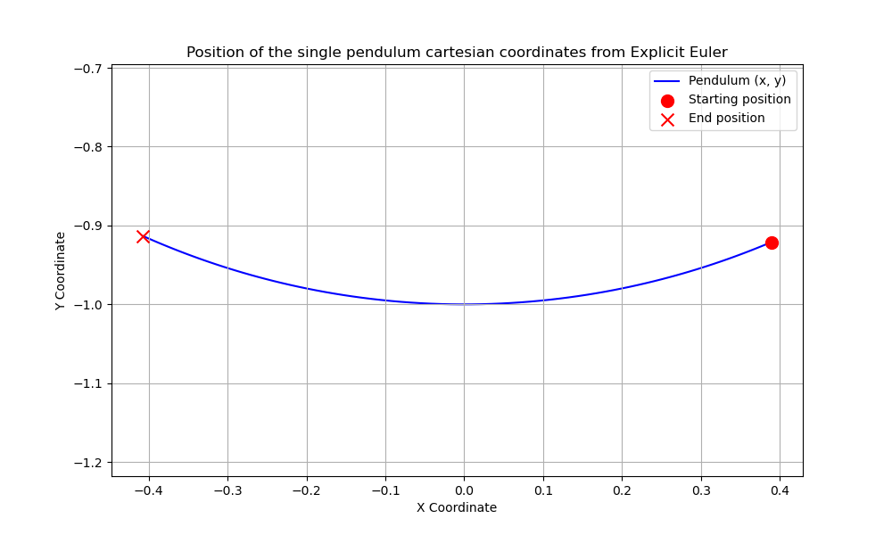
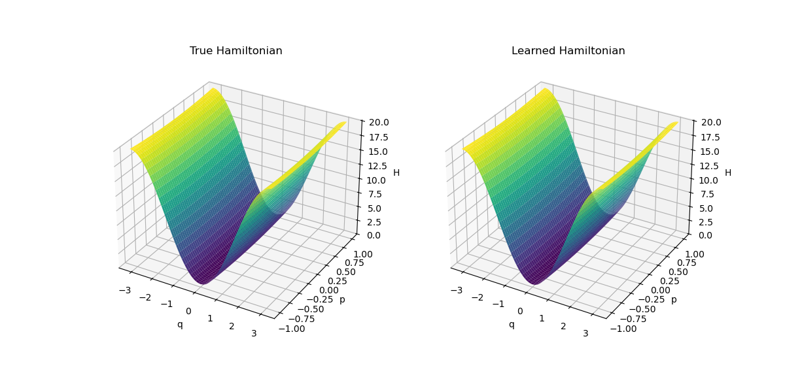

# HNN_Pendulum

This repository contains code for simulating single and double pendulums using numerical solvers, as well as learning the underlying Hamiltonian dynamics with a Hamiltonian Neural Network (HNN). The implementation is based on the works of Greydanus et al. (2019) and Eichelsdörfer et al. (2021).

The primary objective is to train neural networks capable of accurately predicting the trajectories of single and double pendulums. In particular, the learned Hamiltonian is shown to closely match the true Hamiltonian obtained via numerical integration, demonstrating the model's effectiveness in capturing the system’s dynamics:

